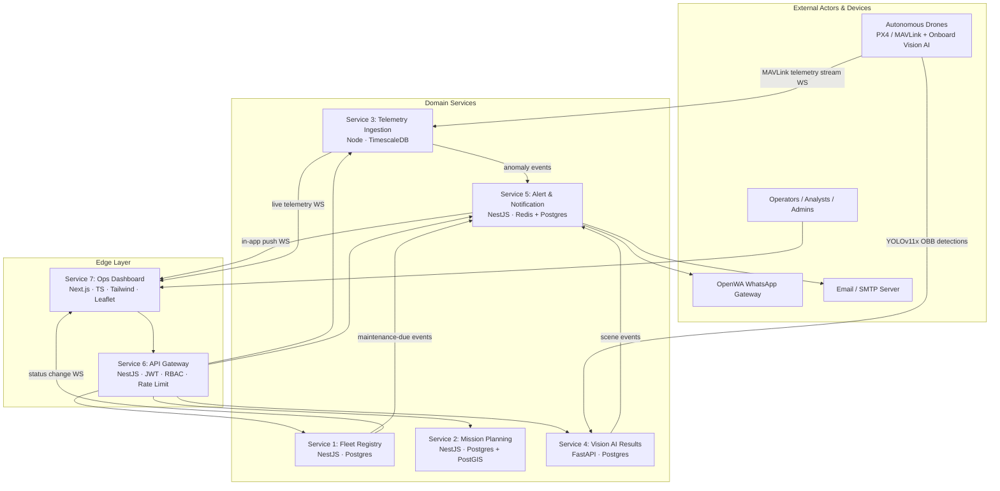
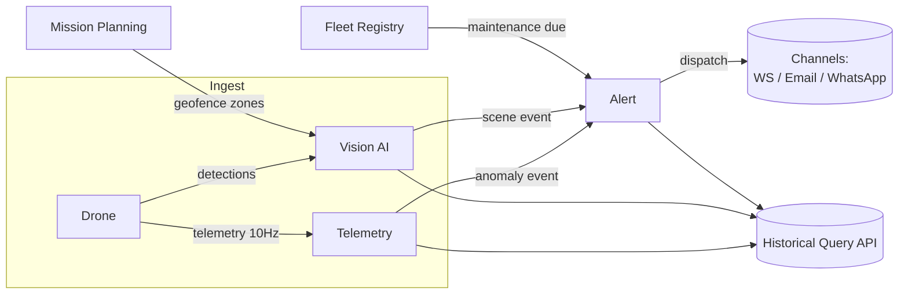
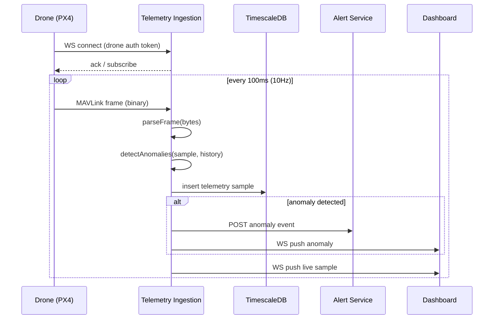
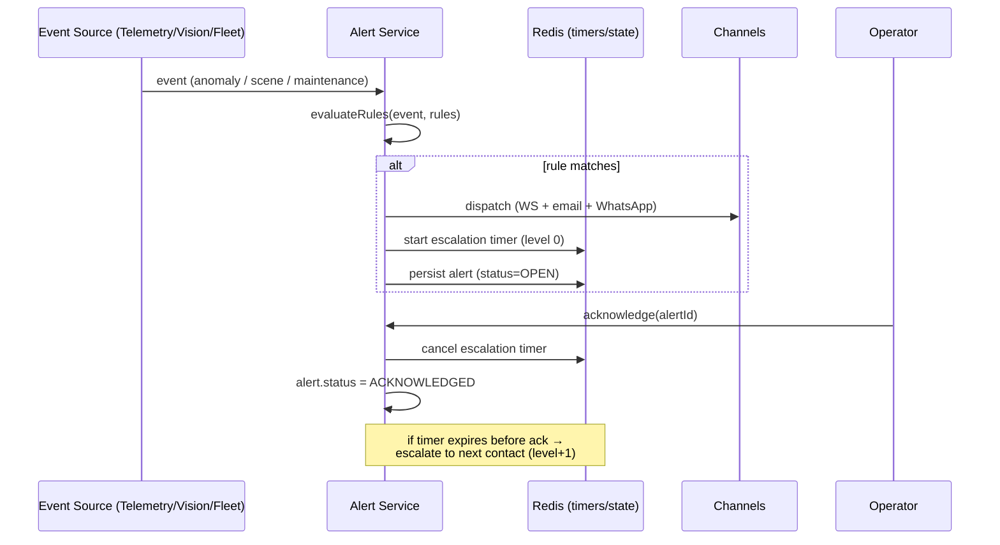

# Design Document: PAWAAC Drone Fleet Operations Platform

## Overview

The PAWAAC Drone Fleet Operations Platform is a production-grade, multi-microservice system for managing autonomous drone surveillance operations end-to-end: from registering physical drone assets and planning geofenced missions, through ingesting high-frequency MAVLink telemetry and onboard Vision-AI detections in real time, to evaluating alert rules and dispatching multi-channel notifications, all surfaced through a single authenticated API gateway and a live operations dashboard.

The platform is decomposed into **seven independently deployable services**. Five are domain backend services (Fleet Registry, Mission Planning, Telemetry Ingestion, Vision AI Results, Alert & Notification), one is an API Gateway that fronts them with authentication, authorization, rate limiting and a merged OpenAPI surface, and one is a Next.js operations dashboard. Services communicate over REST for request/response flows and WebSocket for real-time streams (telemetry, status changes, alert push). Each service owns its own datastore — Postgres (optionally with PostGIS) for relational/geospatial data, TimescaleDB for time-series telemetry, and Redis for alert rule state, escalation timers and rate-limit counters — following the database-per-service pattern to preserve loose coupling.

The system is designed for local orchestration via Docker Compose (all 7 services plus Postgres, TimescaleDB, and Redis), repeatable schema management via TypeORM/Prisma migrations, deterministic seeding for demos and tests, and a GitHub Actions CI pipeline that runs lint → unit → integration → E2E → Docker build for every service. A core engineering principle baked into the design is **green-before-proceed**: each service must have dependencies installed, its full test suite executed, failures diagnosed and fixed, and re-run until fully passing before work advances to the next service.

This document covers both **high-level design** (system context, service decomposition, cross-service data flow, per-service data models, and technology rationale) and **low-level design** (key algorithms with formal specifications — geofence collision detection, telemetry anomaly detection, track stitching, rule-engine evaluation, MAVLink serialization — plus interface/API contracts). It closes with a comprehensive set of **correctness properties** intended to drive property-based testing.

## Architecture

### System Context Diagram



### Service Decomposition

| # | Service | Stack | Datastore | Primary Responsibility |
|---|---------|-------|-----------|------------------------|
| 1 | Fleet Registry | Node.js / NestJS | Postgres | Drone asset CRUD, component lifecycle, maintenance alerts |
| 2 | Mission Planning | Node.js / NestJS | Postgres + PostGIS | Mission/waypoint authoring, geofence conflict detection, MAVLink export |
| 3 | Telemetry Ingestion | Node.js | TimescaleDB | High-throughput MAVLink ingest, anomaly detection, historical query |
| 4 | Vision AI Results | Python / FastAPI | Postgres | Detection ingest, track stitching, scene event classification |
| 5 | Alert & Notification | Node.js / NestJS | Redis + Postgres | Rule engine, multi-channel dispatch, escalation, analytics |
| 6 | API Gateway | Node.js / NestJS | (stateless + Redis for limits) | Routing, JWT auth, RBAC, rate limiting, merged OpenAPI |
| 7 | Ops Dashboard | Next.js / TypeScript / Tailwind | (none; consumes Gateway) | Live map, mission planner UI, telemetry panels, alert feed, replay |

### Cross-Service Data Flow



Key flow notes:
- **Telemetry path:** drones open a WebSocket to Telemetry Ingestion and stream MAVLink frames; each frame is parsed, persisted to TimescaleDB, and passed through the anomaly detector. Anomalies are emitted as events consumed by the Alert service and pushed live to the dashboard.
- **Vision path:** onboard pipeline POSTs YOLOv11x OBB detections; the service stitches them into tracks, classifies scene events against mission-defined zones, and emits scene events to the Alert service.
- **Alerting path:** the Alert service evaluates configurable rules against incoming anomaly/scene/maintenance events; matching rules dispatch via in-app WS, email, and WhatsApp, and start escalation timers.
- **Read path:** the dashboard reads exclusively through the API Gateway, which authenticates the JWT, enforces RBAC + rate limits, and proxies to upstream services.

### Telemetry Ingestion Sequence



### Alert Evaluation & Escalation Sequence



## Technology Choices & Rationale

| Concern | Choice | Rationale |
|---------|--------|-----------|
| Backend framework (TS) | NestJS | Opinionated DI, modular structure, first-class WebSocket + Swagger support, consistent across 4 services |
| Vision service | Python / FastAPI | Vision AI ecosystem (numpy, shapely, tracking libs) is Python-native; FastAPI gives async + auto OpenAPI |
| Relational store | Postgres | Mature, transactional, JSONB for flexible config |
| Geospatial | PostGIS | Native polygon/route geometry + spatial indexes for geofence conflict queries |
| Time-series | TimescaleDB | Hypertables, continuous aggregates and downsampling for high-rate telemetry |
| Cache / timers / counters | Redis | Low-latency escalation timers (sorted sets), rate-limit counters, pub/sub |
| Frontend | Next.js + TS + Tailwind + Leaflet | SSR/streaming, typed UI, map-centric ops view |
| ORM / migrations | Prisma (Node) / TypeORM where richer geometry mapping is needed; SQLAlchemy + Alembic (Python) | Versioned migrations, no raw SQL DDL |
| Shared types | `@pawaac/shared-types` TS package | Single source of truth for DTOs/events across Node services |
| Orchestration | Docker Compose | One-command local bring-up of all 7 services + datastores |
| CI | GitHub Actions | lint → unit → integration → E2E → docker build matrix |

## Components and Interfaces

### Service 1 — Fleet Registry

**Purpose**: System of record for drone assets and their component lifecycle; emits status-change and maintenance-due events.

**Interface (TypeScript)**:
```typescript
type DroneStatus = 'active' | 'maintenance' | 'decommissioned';

interface FleetRegistryService {
  createDrone(input: CreateDroneDto): Promise<Drone>;
  getDrone(id: string): Promise<Drone>;
  listDrones(filter?: DroneFilter): Promise<Drone[]>;
  updateDrone(id: string, patch: UpdateDroneDto): Promise<Drone>;       // emits status-change WS event if status differs
  decommissionDrone(id: string): Promise<Drone>;

  recordComponentUsage(droneId: string, usage: ComponentUsageDto): Promise<ComponentLifecycle>;
  evaluateMaintenance(droneId: string): Promise<MaintenanceAlert[]>;     // pure: derives due/overdue from thresholds
}
```

**Responsibilities**:
- CRUD over drones with optimistic concurrency (version field).
- Track component usage counters (battery cycles, motor hours, propeller replacements).
- Derive maintenance-due/overdue alerts from configurable thresholds.
- Broadcast WebSocket events on status changes and maintenance transitions.

### Service 2 — Mission Planning

**Purpose**: Author, version, and validate missions; detect geofence conflicts; export to PX4 MAVLink.

**Interface (TypeScript)**:
```typescript
interface MissionPlanningService {
  createMission(input: CreateMissionDto): Promise<Mission>;
  updateMission(id: string, patch: UpdateMissionDto): Promise<Mission>; // creates a new immutable version
  getMissionVersion(id: string, version: number): Promise<Mission>;

  defineGeofence(input: GeofenceDto): Promise<Geofence>;                // polygon no-fly zone
  detectConflicts(missionId: string): Promise<GeofenceConflict[]>;      // route vs no-fly polygons

  instantiateTemplate(templateId: string, params: TemplateParams): Promise<Mission>;
  exportMavlink(missionId: string, format: 'json' | 'binary'): Promise<MavlinkMission>;
}
```

**Responsibilities**:
- Versioned, immutable mission records (edit → new version).
- Waypoint validation (altitude/speed/gimbal/loiter ranges).
- Geofence definition and route-vs-polygon conflict detection (PostGIS-backed + in-process algorithm).
- Template library with parameter substitution.
- Deterministic MAVLink mission serialization (JSON and binary).

### Service 3 — Telemetry Ingestion

**Purpose**: Accept many concurrent MAVLink streams, persist samples, detect anomalies, serve historical queries.

**Interface (TypeScript)**:
```typescript
interface TelemetryIngestionService {
  handleConnection(socket: DroneSocket): void;                          // WS server entry
  parseFrame(bytes: Uint8Array): TelemetrySample;                       // MAVLink decode
  detectAnomalies(sample: TelemetrySample, history: SampleWindow): Anomaly[];
  persist(sample: TelemetrySample): Promise<void>;                      // TimescaleDB insert

  queryHistory(q: TelemetryQuery): Promise<TelemetrySeries>;            // time-range + downsample
}
```

**Responsibilities**:
- High-throughput WebSocket server (target ≥10 drones × 10Hz).
- MAVLink parsing into normalized samples (GPS, altitude, velocity, attitude, battery, EKF2 health, RC, flight mode, armed).
- Real-time anomaly detection (altitude drop, battery drain spike, EKF2 degradation, GPS accuracy loss).
- Historical query API with time-range filtering and downsampling.

### Service 4 — Vision AI Results

**Purpose**: Ingest detections, maintain object tracks, classify scene events, serve detection queries.

**Interface (Python)**:
```python
class VisionAIService:
    async def ingest_detections(self, batch: DetectionBatch) -> IngestResult: ...
    def transform_obb(self, obb: OBB, frame: FrameMeta) -> WorldOBB: ...        # pixel/OBB -> normalized/world
    def stitch_tracks(self, dets: list[Detection], active: list[Track]) -> list[Track]:  # ByteTrack-style assoc
        ...
    def classify_scene_events(self, tracks: list[Track], zones: list[Zone]) -> list[SceneEvent]: ...
    async def query_detections(self, q: DetectionQuery) -> list[Detection]: ...
```

**Responsibilities**:
- Ingest YOLOv11x OBB detections (class, confidence, OBB coords, frame timestamp, drone id).
- ByteTrack-compatible track id assignment across frames.
- Scene intelligence: person-entered-zone, vehicle-stopped->60s, group-gathering->5.
- Query API by time range, zone, class, confidence threshold.

### Service 5 — Alert & Notification

**Purpose**: Evaluate alert rules, dispatch multi-channel notifications, manage acknowledgement and escalation, provide analytics.

**Interface (TypeScript)**:
```typescript
interface AlertService {
  upsertRule(rule: AlertRuleDto): Promise<AlertRule>;
  evaluateRules(event: DomainEvent, rules: AlertRule[]): AlertRule[];   // pure matcher
  dispatch(alert: Alert, channels: Channel[]): Promise<DispatchResult>;
  acknowledge(alertId: string, userId: string): Promise<Alert>;        // cancels escalation timer
  tickEscalations(now: Timestamp): Promise<EscalationAction[]>;        // due timers -> next contact
  getAnalytics(q: AnalyticsQuery): Promise<AlertAnalytics>;
}
```

**Responsibilities**:
- Configurable rule engine (condition over event fields + time windows + zones).
- Multi-channel dispatch: in-app WS, email (Nodemailer), WhatsApp (OpenWA REST).
- Acknowledgement workflow and time-based escalation chains.
- History + analytics (alerts per zone/hour, false-positive rate).

### Service 6 — API Gateway

**Purpose**: Single authenticated entry point; routing, RBAC, rate limiting, merged OpenAPI.

**Interface (TypeScript)**:
```typescript
type Role = 'super_admin' | 'operator' | 'analyst' | 'viewer';

interface ApiGateway {
  authenticate(req: Request): AuthContext;          // verify JWT -> {userId, role}
  authorize(ctx: AuthContext, route: RouteMeta): boolean;  // RBAC check
  rateLimit(ctx: AuthContext): RateDecision;        // per-role token bucket (Redis)
  route(req: Request): UpstreamTarget;              // path -> service
  mergedOpenApi(): OpenApiDocument;                 // aggregate upstream specs
}
```

**Responsibilities**:
- JWT verification and role extraction.
- Role-based authorization per route.
- Per-role rate limiting, request logging, trace-header propagation.
- Auto-generated merged OpenAPI 3.0 + single Swagger UI.

### Service 7 — Ops Dashboard Frontend

**Purpose**: Operator-facing UI for live ops, planning, telemetry, alerts, and replay.

**Key surfaces**:
- Real-time fleet map (Leaflet): live positions, battery, flight mode.
- Mission planner: drag-and-drop waypoint editor, geofence drawing, upload.
- Live telemetry panels: attitude indicator, battery graph, EKF2 health, altitude chart.
- Alert feed with acknowledge workflow.
- Detection replay: timeline scrubbing with detections overlaid on the map.

## Data Models

### Fleet Registry (Postgres)
```typescript
interface Drone {
  id: string;                 // UUID
  serialNumber: string;       // unique
  model: string;
  firmwareVersion: string;
  hardwareConfig: Record<string, unknown>;  // JSONB
  status: DroneStatus;
  version: number;            // optimistic lock
  createdAt: string; updatedAt: string;
}

interface ComponentLifecycle {
  droneId: string;
  batteryCycles: number;      // >= 0
  motorHours: number;         // >= 0
  propellerReplacements: number; // >= 0
  thresholds: MaintenanceThresholds;
}

interface MaintenanceThresholds {
  maxBatteryCycles: number; maxMotorHours: number; maxPropellerLifeHours: number;
}
```
**Validation Rules**: `serialNumber` non-empty and unique; counters non-negative; status ∈ enum; `version` monotonically increasing.

### Mission Planning (Postgres + PostGIS)
```typescript
interface Waypoint {
  seq: number;            // 0..n, contiguous
  lat: number;            // [-90, 90]
  lon: number;            // [-180, 180]
  altitude: number;       // meters, > 0 and <= maxAltitude
  speed: number;          // m/s, > 0
  gimbalAngle: number;    // degrees, [-90, 90]
  loiterTime: number;     // seconds, >= 0
}

interface Mission {
  id: string; version: number; name: string;
  waypoints: Waypoint[];        // ordered by seq
  status: 'draft' | 'validated' | 'archived';
  createdAt: string;
}

interface Geofence {
  id: string; name: string;
  polygon: GeoPolygon;          // closed ring, >= 4 points (first == last)
  kind: 'no_fly';
}
```
**Validation Rules**: waypoint seq contiguous starting at 0; coordinate bounds enforced; polygon closed and non-self-intersecting; new edits produce a new `version` (immutability).

### Telemetry Ingestion (TimescaleDB)
```typescript
interface TelemetrySample {
  droneId: string; ts: string;        // hypertable time dimension
  lat: number; lon: number; altitude: number;
  velocity: { vx: number; vy: number; vz: number };
  attitude: { roll: number; pitch: number; yaw: number };
  battery: { voltage: number; current: number; remainingPct: number };  // remainingPct [0,100]
  ekf2: { healthy: boolean; flags: number };
  rcSignalStrength: number;           // [0,100]
  flightMode: string; armed: boolean;
}
```
**Validation Rules**: `ts` strictly required; `remainingPct` ∈ [0,100]; `rcSignalStrength` ∈ [0,100]; samples per (droneId, ts) unique.

### Vision AI Results (Postgres)
```python
@dataclass
class Detection:
    id: str
    drone_id: str
    frame_ts: float            # epoch seconds
    cls: str                   # object class
    confidence: float          # [0,1]
    obb: list[float]           # [cx, cy, w, h, angle]
    track_id: str | None       # assigned by stitching

@dataclass
class Track:
    track_id: str
    cls: str
    detections: list[Detection]   # chronological
    last_seen_ts: float

@dataclass
class SceneEvent:
    kind: str                  # person_entered_zone | vehicle_stopped | group_gathering
    zone_id: str
    track_ids: list[str]
    ts: float
```
**Validation Rules**: `confidence` ∈ [0,1]; OBB has exactly 5 elements with positive w,h; `frame_ts` non-negative; one `track_id` maps to a single object class.

### Alert & Notification (Redis + Postgres)
```typescript
interface AlertRule {
  id: string; name: string; enabled: boolean;
  eventKind: 'anomaly' | 'scene' | 'maintenance';
  conditions: Condition[];        // AND-combined field predicates
  timeWindow?: { startMin: number; endMin: number }; // minutes-of-day [0,1440)
  zoneId?: string;
  severity: 'info' | 'warning' | 'critical';
  channels: Channel[];
  escalationChain: string[];      // ordered contact ids
  escalationIntervalMin: number;  // > 0
}

interface Alert {
  id: string; ruleId: string; severity: string;
  status: 'OPEN' | 'ACKNOWLEDGED' | 'ESCALATED' | 'CLOSED';
  escalationLevel: number;        // 0..len(chain)
  createdAt: string; acknowledgedAt?: string; acknowledgedBy?: string;
}
```
**Validation Rules**: `escalationIntervalMin` > 0; `timeWindow` minutes within [0,1440); status transitions follow OPEN→(ACKNOWLEDGED|ESCALATED)→CLOSED; `escalationLevel` never exceeds chain length.


## Low-Level Design: Key Algorithms with Formal Specifications

### Algorithm 1: Geofence Conflict Detection (Mission Planning)

Detects whether a planned route (sequence of waypoint segments) intersects or is contained by any no-fly polygon.

```typescript
function detectConflicts(waypoints: Waypoint[], noFlyZones: Geofence[]): GeofenceConflict[]
```

**Preconditions:**
- `waypoints.length >= 2` (a route needs at least one segment).
- Each waypoint has valid `lat ∈ [-90,90]`, `lon ∈ [-180,180]`.
- Each polygon is a closed, non-self-intersecting ring with `>= 4` points (first == last).

**Postconditions:**
- Returns one conflict per (segment, zone) pair where the segment intersects the polygon boundary OR lies inside it.
- Result is empty if and only if no route segment touches or enters any no-fly polygon.
- No input mutation; deterministic for fixed inputs.

**Loop Invariants:**
- After processing segment `i`, `conflicts` contains exactly the conflicts for segments `0..i` against all zones.

```pascal
ALGORITHM detectConflicts(waypoints, noFlyZones)
INPUT: waypoints (ordered), noFlyZones (list of closed polygons)
OUTPUT: conflicts (list)
BEGIN
  conflicts <- empty list
  FOR i FROM 0 TO length(waypoints) - 2 DO
    segment <- (waypoints[i], waypoints[i+1])
    FOR each zone IN noFlyZones DO
      IF segmentIntersectsPolygon(segment, zone.polygon)
         OR pointInPolygon(segment.start, zone.polygon)
         OR pointInPolygon(segment.end, zone.polygon) THEN
        conflicts.add({ segmentIndex: i, zoneId: zone.id })
      END IF
    END FOR
  END FOR
  RETURN conflicts
END
```

`pointInPolygon` uses the ray-casting (even-odd) rule; `segmentIntersectsPolygon` tests the segment against each polygon edge using orientation tests. PostGIS `ST_Intersects` provides the production query path; the in-process algorithm is used for unit/property testing and validation parity.

### Algorithm 2: Telemetry Anomaly Detection (Telemetry Ingestion)

Flags anomalies from a new sample given a recent sliding window of history for the same drone.

```typescript
function detectAnomalies(sample: TelemetrySample, history: SampleWindow): Anomaly[]
```

**Preconditions:**
- `history` is ordered ascending by `ts` and all entries share `sample.droneId`.
- `sample.ts` is strictly greater than the last history timestamp (monotonic per drone).

**Postconditions:**
- Returns an anomaly for each threshold breach; empty when the sample is within all thresholds.
- Pure function of (`sample`, `history`) — no side effects, deterministic.

**Detection thresholds (configurable defaults):**
- **Altitude drop**: descent rate `(prev.altitude - sample.altitude) / dt > 10 m/s`.
- **Battery drain spike**: `(prev.remainingPct - sample.remainingPct) / dt` exceeds configured max %/s.
- **EKF2 degradation**: `ekf2.healthy` transitions `true -> false`, or non-zero unhealthy `flags`.
- **GPS accuracy loss**: reported horizontal accuracy worsens beyond threshold, or fix is lost.

```pascal
ALGORITHM detectAnomalies(sample, history)
BEGIN
  anomalies <- empty list
  IF history is empty THEN
    IF NOT sample.ekf2.healthy THEN anomalies.add(EKF2_DEGRADED)
    RETURN anomalies
  END IF
  prev <- last(history)
  dt <- seconds(sample.ts - prev.ts)            // dt > 0 by precondition
  descentRate <- (prev.altitude - sample.altitude) / dt
  IF descentRate > ALT_DROP_THRESHOLD THEN anomalies.add(ALTITUDE_DROP)
  drainRate <- (prev.battery.remainingPct - sample.battery.remainingPct) / dt
  IF drainRate > BATTERY_DRAIN_THRESHOLD THEN anomalies.add(BATTERY_DRAIN_SPIKE)
  IF prev.ekf2.healthy AND NOT sample.ekf2.healthy THEN anomalies.add(EKF2_DEGRADED)
  IF gpsAccuracyWorsened(prev, sample) THEN anomalies.add(GPS_ACCURACY_LOSS)
  RETURN anomalies
END
```

### Algorithm 3: Track Stitching (Vision AI Results)

ByteTrack-style association of new detections to active tracks across frames.

```python
def stitch_tracks(dets: list[Detection], active: list[Track], dt: float) -> list[Track]
```

**Preconditions:**
- All `dets` belong to the same frame (equal `frame_ts`), sorted by descending `confidence`.
- Each detection has a valid OBB and `confidence ∈ [0,1]`.

**Postconditions:**
- Every detection is assigned exactly one `track_id` (matched to an existing track or a newly created one).
- A detection only matches a track of the **same object class** and within the IoU/distance gate.
- Tracks unseen for longer than `MAX_AGE` are retired and not returned as active.
- A new track is created for any unmatched high-confidence detection.

**Loop Invariants:**
- After processing detection `k`, each track has at most one assigned detection from the current frame.

```pascal
ALGORITHM stitchTracks(dets, active, dt)
BEGIN
  // 1. Predict track positions forward by dt (constant-velocity)
  FOR each t IN active DO predict(t, dt)
  matched <- empty set
  // 2. Greedy association: high-confidence first
  FOR each d IN dets ORDERED BY confidence DESC DO
    best <- argmax over unmatched t IN active of IoU(d.obb, t.predicted)
            WHERE t.cls == d.cls AND IoU >= IOU_GATE
    IF best EXISTS THEN
      assign d to best; best.last_seen_ts <- d.frame_ts; matched.add(best)
    ELSE
      newTrack <- createTrack(d); active.add(newTrack)
    END IF
  END FOR
  // 3. Retire stale tracks
  active <- [ t IN active WHERE (now - t.last_seen_ts) <= MAX_AGE ]
  RETURN active
END
```

### Algorithm 4: Scene Event Classification (Vision AI Results)

```python
def classify_scene_events(tracks: list[Track], zones: list[Zone]) -> list[SceneEvent]
```

**Rules:**
- **person_entered_zone**: a `person` track whose latest position is inside a zone while its previous position was outside.
- **vehicle_stopped**: a `vehicle` track whose centroid displacement stays below `MOVE_EPS` for a continuous span `> 60s`.
- **group_gathering**: `> 5` distinct `person` tracks simultaneously inside the same zone.

**Postconditions:** each emitted event references existing `track_id`s and a defined `zone_id`; no event is emitted for tracks/zones not satisfying its predicate.

### Algorithm 5: Rule Engine Evaluation (Alert & Notification)

```typescript
function evaluateRules(event: DomainEvent, rules: AlertRule[]): AlertRule[]
```

**Preconditions:**
- `event` carries `kind`, optional `zoneId`, a `ts`, and a typed payload.
- Each rule's `conditions` reference fields valid for its `eventKind`.

**Postconditions:**
- Returns exactly the enabled rules whose `eventKind` matches, **all** conditions hold (AND semantics), `zoneId` matches when specified, and `event` time-of-day falls within `timeWindow` when specified.
- Pure and order-independent over `rules` (set semantics); deterministic.

```pascal
ALGORITHM evaluateRules(event, rules)
BEGIN
  matches <- empty list
  FOR each r IN rules WHERE r.enabled DO
    IF r.eventKind != event.kind THEN CONTINUE
    IF r.zoneId is set AND r.zoneId != event.zoneId THEN CONTINUE
    IF r.timeWindow is set AND NOT inWindow(minutesOfDay(event.ts), r.timeWindow) THEN CONTINUE
    IF forall c IN r.conditions: evalCondition(c, event) THEN matches.add(r)
  END FOR
  RETURN matches
END
```

`inWindow` supports wrap-around windows (e.g. 22:00–06:00) where `startMin > endMin`.

### Algorithm 6: Escalation Timer Tick (Alert & Notification)

```typescript
function tickEscalations(now: Timestamp): EscalationAction[]
```

**Preconditions:** open alerts have a `nextEscalationAt` stored in a Redis sorted set keyed by timestamp.

**Postconditions:**
- For each open, unacknowledged alert whose `nextEscalationAt <= now`: increment `escalationLevel`, dispatch to the next contact in the chain, and reschedule `nextEscalationAt += escalationIntervalMin` (until the chain is exhausted, after which status becomes `ESCALATED` terminal).
- Acknowledged/closed alerts are never escalated.

### Algorithm 7: MAVLink Mission Serialization (Mission Planning)

```typescript
function exportMavlink(mission: Mission, format: 'json' | 'binary'): MavlinkMission
```

**Preconditions:**
- Mission is `validated` (all waypoints pass validation, seq contiguous from 0).

**Postconditions:**
- Produces a PX4-compatible `MISSION_ITEM_INT` sequence: a home/takeoff item followed by one item per waypoint, preserving order.
- **Round-trip property**: `parseMavlink(exportMavlink(m, 'binary')) == canonicalize(m)` for waypoint geometry and params.
- Latitude/longitude are encoded as int32 `degrees * 1e7`; altitude in meters; deterministic byte output for a fixed mission.

```pascal
ALGORITHM exportMavlink(mission, format)
BEGIN
  items <- empty list
  items.add(makeHomeItem(mission.waypoints[0]))
  FOR each wp IN mission.waypoints DO
    item <- MISSION_ITEM_INT {
      seq: wp.seq,
      command: NAV_WAYPOINT,
      x: round(wp.lat * 1e7), y: round(wp.lon * 1e7), z: wp.altitude,
      param1: wp.loiterTime, param4: wp.gimbalAngle
    }
    items.add(item)
  END FOR
  IF format == 'binary' THEN RETURN encodeBinary(items)
  ELSE RETURN { items }
END
```

## Key Functions with Formal Specifications (Interface Contracts Summary)

| Function | Pre | Post |
|----------|-----|------|
| `evaluateMaintenance(drone)` | counters non-negative, thresholds set | returns due alert iff any counter ≥ its threshold; pure |
| `updateMission(id, patch)` | mission exists | creates new immutable version; prior versions unchanged |
| `parseFrame(bytes)` | bytes is a complete MAVLink frame | returns normalized sample; rejects malformed frames |
| `queryHistory(q)` | `q.from <= q.to` | returns samples within `[from,to]`; downsample bucket count ≤ requested |
| `authorize(ctx, route)` | ctx has valid role | true iff role permitted for route; default-deny |
| `rateLimit(ctx)` | role known | allows ≤ role's configured rate per window; deterministic given counter state |
| `acknowledge(alertId, userId)` | alert OPEN/ESCALATED | status→ACKNOWLEDGED; escalation timer cancelled; idempotent |

## Example Usage

```typescript
// Mission planning: author, validate, detect conflicts, export
const mission = await missions.createMission({ name: 'Perimeter Sweep', waypoints });
const conflicts = await missions.detectConflicts(mission.id);
if (conflicts.length === 0) {
  const mav = await missions.exportMavlink(mission.id, 'binary');
  await uploadToDrone(mav);
}
```

```python
# Vision AI: ingest -> stitch -> classify
result = await vision.ingest_detections(batch)
tracks = vision.stitch_tracks(batch.detections, active_tracks, dt=batch.dt)
events = vision.classify_scene_events(tracks, mission_zones)
for e in events:
    await alert_client.emit(e)
```

```typescript
// Alerting: evaluate and dispatch
const matched = alerts.evaluateRules(event, activeRules);
for (const rule of matched) {
  const alert = await alerts.open(rule, event);
  await alerts.dispatch(alert, rule.channels);
}
```


## Correctness Properties

These properties are intended to drive property-based testing (fast-check for Node services, Hypothesis for the Python Vision service). Each is stated as a universally quantified invariant over generated inputs.

### Fleet Registry
- **P1 — Status round-trip:** ∀ drone d, status s: `update(d, {status: s})` then `get(d.id).status == s`.
- **P2 — Version monotonicity:** ∀ drone d, every successful update yields `version' > version`.
- **P3 — Counters non-negative:** ∀ usage sequences, all lifecycle counters remain `>= 0`.
- **P4 — Maintenance soundness:** ∀ lifecycle L: `evaluateMaintenance` returns a due alert for a component **iff** its counter `>=` its configured threshold.
- **P5 — Status-change event fidelity:** a WS status-change event is emitted **iff** the persisted status actually changed.
- **P6 — Serial uniqueness:** ∀ create requests, no two drones share a `serialNumber`.

### Mission Planning
- **P7 — Conflict completeness:** ∀ route R, zones Z: `detectConflicts` is empty **iff** no segment of R enters or touches any polygon in Z.
- **P8 — Conflict determinism:** repeated `detectConflicts` on identical inputs return identical results.
- **P9 — Point-in-polygon parity:** in-process ray-casting agrees with PostGIS `ST_Contains` for all generated points/polygons (modulo boundary tolerance).
- **P10 — Waypoint validation:** a mission validates **iff** every waypoint satisfies all range constraints and seq is contiguous from 0.
- **P11 — Immutable versioning:** ∀ mission m, editing creates version `v+1` and leaves version `v` byte-identical.
- **P12 — MAVLink round-trip:** ∀ validated mission m: `parseMavlink(exportMavlink(m,'binary'))` equals the canonical waypoint geometry/params of m.
- **P13 — Export determinism:** `exportMavlink(m,'binary')` produces identical bytes across runs.
- **P14 — Template substitution totality:** instantiating a template with valid params leaves no unresolved placeholders.

### Telemetry Ingestion
- **P15 — Parse/serialize round-trip:** ∀ valid sample s: `parseFrame(encode(s))` reconstructs s within numeric tolerance.
- **P16 — Anomaly purity:** `detectAnomalies` is a pure function — equal (sample, history) ⇒ equal output.
- **P17 — Altitude-drop soundness/completeness:** an `ALTITUDE_DROP` anomaly is produced **iff** descent rate `> threshold`.
- **P18 — Bounds invariants:** persisted samples always have `remainingPct ∈ [0,100]` and `rcSignalStrength ∈ [0,100]`.
- **P19 — Monotonic timestamps:** per drone, persisted samples are strictly increasing in `ts`.
- **P20 — Downsampling bound:** `queryHistory` returns at most the requested bucket count and only samples within `[from,to]`.
- **P21 — Query time-range soundness:** every returned sample satisfies `from <= ts <= to`.

### Vision AI Results
- **P22 — Total assignment:** ∀ detection set, after `stitch_tracks` every detection has exactly one `track_id`.
- **P23 — Class consistency:** ∀ track t, all detections in t share the same object class.
- **P24 — OBB transform invertibility:** `transform_obb` composed with its inverse returns the original OBB within tolerance.
- **P25 — Confidence preservation:** stitching never alters a detection's `confidence` or class.
- **P26 — Stale retirement:** any track unseen longer than `MAX_AGE` is absent from the returned active set.
- **P27 — Group-gathering threshold:** a `group_gathering` event fires **iff** `> 5` distinct person tracks are simultaneously in the same zone.
- **P28 — Zone-entry edge:** `person_entered_zone` fires **iff** the track's position transitions from outside to inside the zone.
- **P29 — Query filter soundness:** `query_detections` returns only detections matching all of (time range, zone, class, `confidence >= threshold`).

### Alert & Notification
- **P30 — Rule match soundness:** `evaluateRules` returns a rule **iff** it is enabled, kind matches, zone matches (if set), time window holds (if set), and all conditions hold.
- **P31 — Rule order independence:** permuting the `rules` input yields the same matched set.
- **P32 — Time-window wrap-around:** windows with `startMin > endMin` correctly include times after `startMin` or before `endMin`.
- **P33 — Ack cancels escalation:** an acknowledged alert is never subsequently escalated.
- **P34 — Escalation bound:** `escalationLevel` never exceeds `escalationChain.length`.
- **P35 — Escalation monotonicity:** each tick that escalates strictly increases `escalationLevel` and reschedules further in the future.
- **P36 — Ack idempotency:** acknowledging an already-acknowledged alert is a no-op returning the same state.
- **P37 — Dispatch fan-out:** a dispatched alert is sent to exactly the channels configured on its rule.
- **P38 — Status transition legality:** alert status only follows OPEN→(ACKNOWLEDGED|ESCALATED)→CLOSED.
- **P39 — Analytics conservation:** sum of per-zone/per-hour alert counts equals total alerts in the queried range.

### API Gateway
- **P40 — Default deny:** `authorize` returns false for any (role, route) pair not explicitly permitted.
- **P41 — Role monotonicity:** any route permitted to a lower-privilege role is also permitted to Super Admin.
- **P42 — Rate-limit safety:** the number of allowed requests in a window never exceeds the role's configured limit.
- **P43 — Routing totality & disjointness:** every known path maps to exactly one upstream target; unknown paths 404.
- **P44 — Trace propagation:** every proxied request carries a non-empty trace id downstream.
- **P45 — Auth required:** requests without a valid JWT are rejected before reaching any upstream.

## Error Handling

| Scenario | Condition | Response | Recovery |
|----------|-----------|----------|----------|
| Malformed MAVLink frame | `parseFrame` decode failure | Drop frame, increment `telemetry_parse_errors` metric, keep socket open | Continue with next frame; alert if error rate high |
| Telemetry WS overload | Backpressure exceeds buffer | Apply per-socket flow control; shed lowest-priority samples | Auto-recover when queue drains; emit capacity warning |
| Geofence conflict on export | `detectConflicts` non-empty | 409 Conflict; block MAVLink export | Operator edits route; re-validate |
| Invalid waypoint | Range/seq violation | 422 with field-level errors | Client corrects payload |
| OpenWA/email channel down | Dispatch HTTP/SMTP error | Mark channel delivery failed; retry with backoff; fall back to in-app WS | Escalation continues on other channels |
| Duplicate detection batch | Idempotency key seen | Return prior `IngestResult` (idempotent) | None needed |
| JWT expired/invalid | Gateway auth failure | 401 Unauthorized | Client re-authenticates |
| Rate limit exceeded | Token bucket empty | 429 with `Retry-After` | Client backs off |
| DB migration drift | Schema mismatch at boot | Fail fast on startup health check | Run migrations; redeploy |
| Optimistic lock conflict | Stale `version` on update | 409 Conflict | Client refetches and retries |

All services expose `/health` (liveness) and `/ready` (readiness incl. datastore connectivity), return RFC 7807 problem+json error bodies, and propagate `X-Trace-Id`.

## Testing Strategy

### Unit Testing
- **Fleet Registry:** all service methods (CRUD, lifecycle counters, `evaluateMaintenance`).
- **Mission Planning:** geofence collision detection, waypoint validation, MAVLink serialization.
- **Telemetry:** MAVLink parser, each anomaly detector branch.
- **Vision AI:** OBB transforms, track stitching, scene event classification.
- **Alert:** rule-engine evaluation, escalation timer logic.
- **Gateway:** authorize/rateLimit/route pure logic.

### Property-Based Testing
- **Libraries:** `fast-check` (Node/TS services), `Hypothesis` (Python Vision service).
- Drives all properties P1–P45 above with generators for drones, missions/waypoints, polygons, telemetry windows, detections/tracks, rules/events, and (role, route) pairs.

### Integration Testing
- Fleet Registry: all REST endpoints against a real Postgres (Testcontainers).
- Mission Planning: all CRUD endpoints incl. PostGIS conflict queries.
- Telemetry: historical query endpoints against TimescaleDB.
- Vision AI: ingestion + query endpoints against Postgres.
- Alert: each notification channel with mocked OpenWA and email (Nodemailer test transport).
- Gateway: auth flows, rate limiting, routing to upstreams.

### End-to-End Testing
- Fleet Registry: WebSocket status-change events.
- Dashboard (Playwright): login, create mission, view telemetry, acknowledge alert, detection replay.

### Load / Performance Testing
- Telemetry Ingestion: simulate **10 concurrent drone streams at 10Hz** sustained; record throughput, p50/p95/p99 ingest latency, dropped-frame rate; document in `BENCHMARKS.md`.

### Green-Before-Proceed Quality Gate (Engineering Principle)
For every service, the workflow is mandatory and sequential: **install dependencies → run the full test suite → read failures → fix → re-run until fully green** before moving to the next service. CI enforces the same ordering: `lint → unit → integration → E2E → docker build`. A service is not "done" until its suite passes locally and in CI.

## Performance Considerations
- **Telemetry throughput:** binary MAVLink parsing, batched TimescaleDB inserts, hypertable chunking, and continuous aggregates for downsampled queries. Target ≥100 samples/s aggregate (10×10Hz) with headroom.
- **Geofence queries:** PostGIS GiST spatial indexes on polygons; bounding-box pre-filter before exact intersection.
- **Rate limiting/escalation:** Redis sorted sets and atomic Lua scripts to avoid race conditions under concurrency.
- **Dashboard:** WebSocket multiplexing and client-side throttling of live telemetry to render-safe rates.

## Security Considerations
- **AuthN/Z:** JWT at the gateway; RBAC with four roles (Super Admin, Operator, Analyst, Viewer); default-deny authorization.
- **Transport:** TLS termination at the gateway; drone WS connections authenticated with per-drone tokens.
- **Input validation:** DTO validation at every service boundary (class-validator / Pydantic).
- **Rate limiting & abuse:** per-role limits; request logging with trace ids for audit.
- **Secrets:** all credentials (DB, SMTP, OpenWA, JWT secret) via environment variables, documented in env reference; never committed.
- **Least privilege:** each service uses a scoped DB user limited to its own schema.

## Dependencies

### Runtime / Frameworks
- Node.js (NestJS for Services 1, 2, 5, 6; plain Node for Service 3), Python 3.11+ (FastAPI for Service 4), Next.js + React + TypeScript + Tailwind (Service 7).

### Datastores
- PostgreSQL, PostGIS extension (Service 2), TimescaleDB (Service 3), Redis (Services 5, 6).

### Key Libraries
- **Geometry:** PostGIS + in-process geometry helper; Python `shapely` for Vision zone checks.
- **MAVLink:** MAVLink serialization/parse library (PX4-compatible mission protocol).
- **Notifications:** Nodemailer (email), OpenWA REST client (WhatsApp), WebSocket gateway (in-app).
- **ORM/Migrations:** Prisma and/or TypeORM (Node), SQLAlchemy + Alembic (Python). No raw SQL DDL.
- **Testing:** Jest + fast-check + Supertest + Testcontainers (Node), Pytest + Hypothesis (Python), Playwright (E2E), k6/Artillery (load).
- **Shared:** `@pawaac/shared-types` TypeScript package consumed by all Node services.

### Infrastructure / Tooling
- Docker + Docker Compose (all 7 services + Postgres + TimescaleDB + Redis).
- GitHub Actions CI: lint → unit → integration → E2E → Docker build matrix per service.
- Seed script: 5 drones, 3 missions, 72h synthetic telemetry, 200 detections, 15 alerts.
- Documentation: per-service README + root README with Mermaid architecture diagram, setup, and env-var reference; `BENCHMARKS.md` for telemetry load results.
