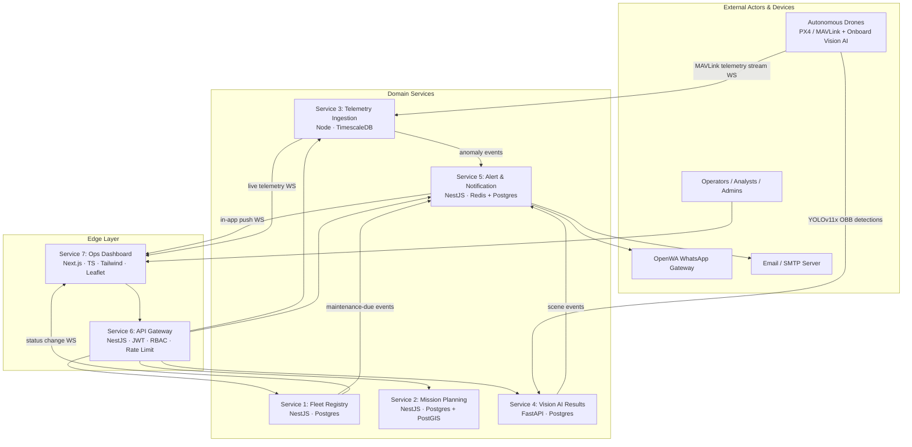

# PAWAAC Drone Fleet Operations Platform

A production-grade, multi-microservice platform for managing autonomous drone
surveillance operations end-to-end: registering physical drone assets, planning
geofenced missions, ingesting high-frequency MAVLink telemetry and onboard
Vision-AI detections in real time, evaluating alert rules and dispatching
multi-channel notifications, all fronted by a single authenticated API gateway
and surfaced through a live Next.js operations dashboard.

The platform is a **pnpm monorepo** of **seven independently deployable
services** plus a shared TypeScript types package, orchestrated for local
development with **Docker Compose** (all 7 services + Postgres, PostGIS,
TimescaleDB, and Redis).

## Architecture



Services communicate over REST for request/response flows and WebSocket for
real-time streams (telemetry, status changes, alert push). Each service owns its
own datastore (the **database-per-service** pattern) — no service reaches into
another's datastore.

## Services at a Glance

| # | Service | Stack | Datastore | Responsibility | Docs |
|---|---------|-------|-----------|----------------|------|
| 1 | Fleet Registry | NestJS / TypeScript | Postgres | Drone asset CRUD, component lifecycle, maintenance alerts | [README](services/fleet-registry/README.md) |
| 2 | Mission Planning | NestJS / TypeScript | Postgres + PostGIS | Mission/waypoint authoring, geofence conflict detection, MAVLink export | [README](services/mission-planning/README.md) |
| 3 | Telemetry Ingestion | Node.js / TypeScript | TimescaleDB | High-throughput MAVLink ingest, anomaly detection, historical query | [README](services/telemetry-ingestion/README.md) |
| 4 | Vision AI Results | Python / FastAPI | Postgres | Detection ingest, track stitching, scene event classification | [README](services/vision-ai/README.md) |
| 5 | Alert & Notification | NestJS / TypeScript | Redis + Postgres | Rule engine, multi-channel dispatch, escalation, analytics | [README](services/alert-notification/README.md) |
| 6 | API Gateway | NestJS / TypeScript | (stateless + Redis) | Routing, JWT auth, RBAC, rate limiting, merged OpenAPI | [README](services/api-gateway/README.md) |
| 7 | Ops Dashboard | Next.js / React / TS | (none; consumes Gateway) | Live map, mission planner, telemetry panels, alert feed, replay | [README](services/ops-dashboard/README.md) |
| — | Shared Types | TypeScript library | — | Cross-service DTOs and domain events (`@pawaac/shared-types`) | [README](packages/shared-types/README.md) |

## Prerequisites

- **Docker** and **Docker Compose v2** (`docker compose ...`) — the only hard
  requirement for a full one-command bring-up.
- For local (non-container) development of individual workspaces:
  - **Node.js >= 20** and **pnpm 10** (`corepack enable` provisions the pinned
    `pnpm@10.28.1` from `package.json`).
  - **Python >= 3.11** (Vision AI service only).

## Quick Start (Docker Compose)

1. **Create your environment file** from the documented template and fill in
   real secrets (every `CHANGE_ME_*` value):

   ```bash
   cp .env.example .env
   # edit .env and replace every CHANGE_ME value
   ```

   `.env` is git-ignored and **must never be committed** — all credentials are
   supplied exclusively through environment variables.

2. **Bring up the whole platform** with fail-fast semantics:

   ```bash
   docker compose up --build --wait --abort-on-container-failure
   ```

   - `--build` builds each service image from its Dockerfile.
   - `--wait` blocks until every container reports healthy (each service and
     datastore declares a healthcheck).
   - `--abort-on-container-failure` tears the whole stack down if **any**
     component fails to become healthy, rather than leaving a partial
     environment running.

3. **Use the platform.** Once healthy, the entrypoints are:
   - Ops Dashboard: <http://localhost:3006>
   - API Gateway (single authenticated API surface): <http://localhost:3000>
   - Merged Swagger UI (all upstream specs): <http://localhost:3000/docs>
     (raw merged spec at `/openapi.json`)

4. **Tear down:**

   ```bash
   docker compose down           # stop and remove containers
   docker compose down -v        # also remove datastore volumes (wipes data)
   ```

## Database Migrations & Seeding

Each backend service owns its schema and manages it via versioned migrations
(no raw SQL DDL). Migrations are run from within each service workspace; see the
per-service README for the exact command. Summary:

| Service | Migration tooling | Command (run in the service dir) |
|---------|-------------------|----------------------------------|
| Fleet Registry | TypeORM | `pnpm typeorm migration:run -d src/data-source.ts` |
| Mission Planning | TypeORM | `pnpm typeorm migration:run -d src/data-source.ts` |
| Telemetry Ingestion | node-pg-migrate | `pnpm migrate:up` |
| Vision AI | Alembic | `alembic upgrade head` |
| Alert & Notification | TypeORM | `pnpm migration:run` |

A deterministic seed script (5 drones, 3 missions, 72h of telemetry, 200
detections, 15 alerts) is provided by the cross-cutting finalization tasks; run
it after migrations against a running stack.

## Running Tests & Lint Per Workspace

From the **repository root**, the workspace-aware scripts fan out across every
package that defines the matching script:

```bash
pnpm install            # install all workspace dependencies
pnpm -r run build       # build every workspace (topological order)
pnpm -r run test        # run every workspace's test suite
pnpm lint               # eslint across the monorepo
pnpm format:check       # prettier check across the monorepo
pnpm typecheck          # per-workspace typecheck
```

To target a **single workspace**, use pnpm's filter (or `cd` into it):

```bash
pnpm --filter @pawaac/fleet-registry run test
pnpm --filter @pawaac/api-gateway run lint
```

The Python Vision AI service is outside the pnpm toolchain — see
[its README](services/vision-ai/README.md) for `pytest` / `ruff` usage.

CI (GitHub Actions) runs the same ordering per service: **lint → unit →
integration → E2E → docker build**, failing fast on the first failed stage.

## Ports

All host-published ports are configurable via `.env`; defaults below.

| Component | Env var | Host port | Container port |
|-----------|---------|-----------|----------------|
| API Gateway | `API_GATEWAY_PORT` | 3000 | 3000 |
| Fleet Registry | `FLEET_REGISTRY_PORT` | 3001 | 3001 |
| Mission Planning | `MISSION_PLANNING_PORT` | 3002 | 3002 |
| Telemetry Ingestion | `TELEMETRY_INGESTION_PORT` | 3003 | 3003 |
| Alert & Notification | `ALERT_NOTIFICATION_PORT` | 3005 | 3005 |
| Vision AI Results | `VISION_AI_PORT` | 8000 | 8000 |
| Ops Dashboard | `OPS_DASHBOARD_PORT` | 3006 | 3006 |
| Postgres (Fleet) | `FLEET_DB_HOST_PORT` | 5432 | 5432 |
| Postgres + PostGIS (Mission) | `MISSION_DB_HOST_PORT` | 5433 | 5432 |
| Postgres (Vision) | `VISION_DB_HOST_PORT` | 5434 | 5432 |
| Postgres (Alert) | `ALERT_DB_HOST_PORT` | 5435 | 5432 |
| TimescaleDB (Telemetry) | `TELEMETRY_DB_HOST_PORT` | 5436 | 5432 |
| Redis (shared) | `REDIS_HOST_PORT` | 6379 | 6379 |

> The datastore host ports are for **local inspection only**. In-network,
> services reach datastores on their container ports (5432/6379) over the
> `pawaac-net` Docker network.

## Environment Variable Reference

All configuration and secrets are supplied through environment variables and
documented in [`.env.example`](.env.example). Copy it to `.env` and replace
every `CHANGE_ME_*` placeholder. **Variables marked 🔑 are secrets** that must be
supplied with strong, unique values and never committed.

### Global / cross-cutting

| Variable | Default | Secret | Description |
|----------|---------|:------:|-------------|
| `NODE_ENV` | `production` | | Node runtime environment. |
| `LOG_LEVEL` | `info` | | Log verbosity across all services. |
| `TRACE_HEADER` | `X-Trace-Id` | | Header used to propagate the distributed trace id across services. |

### Authentication (API Gateway)

| Variable | Default | Secret | Description |
|----------|---------|:------:|-------------|
| `JWT_SECRET` | `CHANGE_ME_...` | 🔑 | Secret used to sign/verify JWTs at the gateway. Use a long random string. |
| `JWT_EXPIRES_IN` | `1h` | | JWT lifetime. |
| `DRONE_AUTH_TOKEN` | `CHANGE_ME_...` | 🔑 | Per-drone shared token presented when opening the telemetry WebSocket. |

### Service ports

| Variable | Default | Description |
|----------|---------|-------------|
| `API_GATEWAY_PORT` | `3000` | Host port for the API Gateway. |
| `FLEET_REGISTRY_PORT` | `3001` | Host port for Fleet Registry. |
| `MISSION_PLANNING_PORT` | `3002` | Host port for Mission Planning. |
| `TELEMETRY_INGESTION_PORT` | `3003` | Host port for Telemetry Ingestion. |
| `ALERT_NOTIFICATION_PORT` | `3005` | Host port for Alert & Notification. |
| `VISION_AI_PORT` | `8000` | Host port for Vision AI Results. |
| `OPS_DASHBOARD_PORT` | `3006` | Host port for the Ops Dashboard. |

### Datastore host-published ports

| Variable | Default | Description |
|----------|---------|-------------|
| `FLEET_DB_HOST_PORT` | `5432` | Fleet Registry Postgres host port. |
| `MISSION_DB_HOST_PORT` | `5433` | Mission Planning Postgres/PostGIS host port. |
| `VISION_DB_HOST_PORT` | `5434` | Vision AI Postgres host port. |
| `ALERT_DB_HOST_PORT` | `5435` | Alert & Notification Postgres host port. |
| `TELEMETRY_DB_HOST_PORT` | `5436` | Telemetry Ingestion TimescaleDB host port. |
| `REDIS_HOST_PORT` | `6379` | Shared Redis host port. |

### Database-per-service credentials

Each backend service owns a dedicated datastore and a dedicated scoped user.

| Variable | Default | Secret | Description |
|----------|---------|:------:|-------------|
| `FLEET_DB_USER` | `fleet_registry` | | Fleet Registry DB user. |
| `FLEET_DB_PASSWORD` | `CHANGE_ME_...` | 🔑 | Fleet Registry DB password. |
| `FLEET_DB_NAME` | `fleet_registry` | | Fleet Registry database name. |
| `MISSION_DB_USER` | `mission_planning` | | Mission Planning DB user. |
| `MISSION_DB_PASSWORD` | `CHANGE_ME_...` | 🔑 | Mission Planning DB password. |
| `MISSION_DB_NAME` | `mission_planning` | | Mission Planning database name. |
| `VISION_DB_USER` | `vision_ai` | | Vision AI DB user. |
| `VISION_DB_PASSWORD` | `CHANGE_ME_...` | 🔑 | Vision AI DB password. |
| `VISION_DB_NAME` | `vision_ai` | | Vision AI database name. |
| `ALERT_DB_USER` | `alert_notification` | | Alert & Notification DB user. |
| `ALERT_DB_PASSWORD` | `CHANGE_ME_...` | 🔑 | Alert & Notification DB password. |
| `ALERT_DB_NAME` | `alert_notification` | | Alert & Notification database name. |
| `TELEMETRY_DB_USER` | `telemetry` | | Telemetry Ingestion DB user. |
| `TELEMETRY_DB_PASSWORD` | `CHANGE_ME_...` | 🔑 | Telemetry Ingestion DB password. |
| `TELEMETRY_DB_NAME` | `telemetry` | | Telemetry Ingestion database name. |

### Redis (shared by Alert & Gateway)

Logically separated by Redis DB index so the two consumers never collide.

| Variable | Default | Secret | Description |
|----------|---------|:------:|-------------|
| `REDIS_PASSWORD` | `CHANGE_ME_...` | 🔑 | Redis auth password (`requirepass`). |
| `ALERT_REDIS_DB` | `0` | | Redis DB index for Alert escalation timers/state. |
| `GATEWAY_REDIS_DB` | `1` | | Redis DB index for API Gateway rate-limit counters. |

### Telemetry anomaly-detection thresholds (Service 3)

| Variable | Default | Description |
|----------|---------|-------------|
| `ALT_DROP_THRESHOLD` | `10` | Descent rate (m/s) above which an `ALTITUDE_DROP` anomaly is flagged. |
| `BATTERY_DRAIN_THRESHOLD` | `1` | Battery drain rate (%/s) above which a `BATTERY_DRAIN_SPIKE` anomaly is flagged. |

### Vision AI tracking parameters (Service 4)

| Variable | Default | Description |
|----------|---------|-------------|
| `TRACK_MAX_AGE` | `30` | Seconds a track may go unseen before it is retired from the active set. |
| `MOVE_EPS` | `2.0` | Max centroid displacement treated as "not moving" for `vehicle_stopped`. |

### Email channel — SMTP (Alert & Notification)

| Variable | Default | Secret | Description |
|----------|---------|:------:|-------------|
| `SMTP_HOST` | `smtp.example.com` | | SMTP server host. |
| `SMTP_PORT` | `587` | | SMTP server port. |
| `SMTP_USER` | `CHANGE_ME_...` | 🔑 | SMTP username. |
| `SMTP_PASSWORD` | `CHANGE_ME_...` | 🔑 | SMTP password. |
| `SMTP_FROM` | `alerts@pawaac.example.com` | | From address for outbound alert emails. |
| `SMTP_SECURE` | `false` | | Whether to use a TLS-on-connect transport. |

### WhatsApp channel — OpenWA REST (Alert & Notification)

| Variable | Default | Secret | Description |
|----------|---------|:------:|-------------|
| `OPENWA_API_URL` | `http://localhost:8002` | | OpenWA REST base URL. |
| `OPENWA_API_KEY` | `CHANGE_ME_...` | 🔑 | OpenWA API key. |
| `OPENWA_SESSION` | `default` | | OpenWA session name. |

### Ops Dashboard (Next.js) — browser-facing URLs

These are inlined into the client bundle at build time.

| Variable | Default | Description |
|----------|---------|-------------|
| `NEXT_PUBLIC_API_GATEWAY_URL` | `http://localhost:3000` | Browser-facing API Gateway URL. |
| `NEXT_PUBLIC_WS_URL` | `ws://localhost:3000` | Browser-facing WebSocket URL. |

> **Optional API Gateway rate-limit overrides** (not in `.env.example`, sensible
> defaults applied if unset): `RATE_LIMIT_WINDOW_SEC` (default `60`),
> `RATE_LIMIT_VIEWER` (`60`), `RATE_LIMIT_ANALYST` (`120`),
> `RATE_LIMIT_OPERATOR` (`240`), `RATE_LIMIT_SUPER_ADMIN` (`600`).

## Repository Layout

```
.
├── docker-compose.yml         # one-command local orchestration of all 7 services + datastores
├── .env.example               # full environment-variable reference (copy to .env)
├── package.json               # root workspace scripts (lint/format/build/test)
├── pnpm-workspace.yaml         # workspace globs: packages/* and services/*
├── packages/
│   └── shared-types/           # @pawaac/shared-types — cross-service DTOs & events
└── services/
    ├── fleet-registry/         # Service 1 (NestJS + Postgres)
    ├── mission-planning/       # Service 2 (NestJS + Postgres/PostGIS)
    ├── telemetry-ingestion/    # Service 3 (Node + TimescaleDB)
    ├── vision-ai/              # Service 4 (FastAPI + Postgres)
    ├── alert-notification/     # Service 5 (NestJS + Redis + Postgres)
    ├── api-gateway/            # Service 6 (NestJS)
    └── ops-dashboard/          # Service 7 (Next.js)
```

## Security & Secrets

- All credentials (database, SMTP, OpenWA, JWT secret, drone token) are provided
  via environment variables and documented in `.env.example`; **none are
  committed**. `.env` is git-ignored.
- JWT authentication and default-deny RBAC (four roles: Super Admin, Operator,
  Analyst, Viewer) are enforced at the API Gateway.
- Each service uses a dedicated, scoped database user limited to its own
  datastore.
- Drone WebSocket connections are authenticated with a per-drone token.
